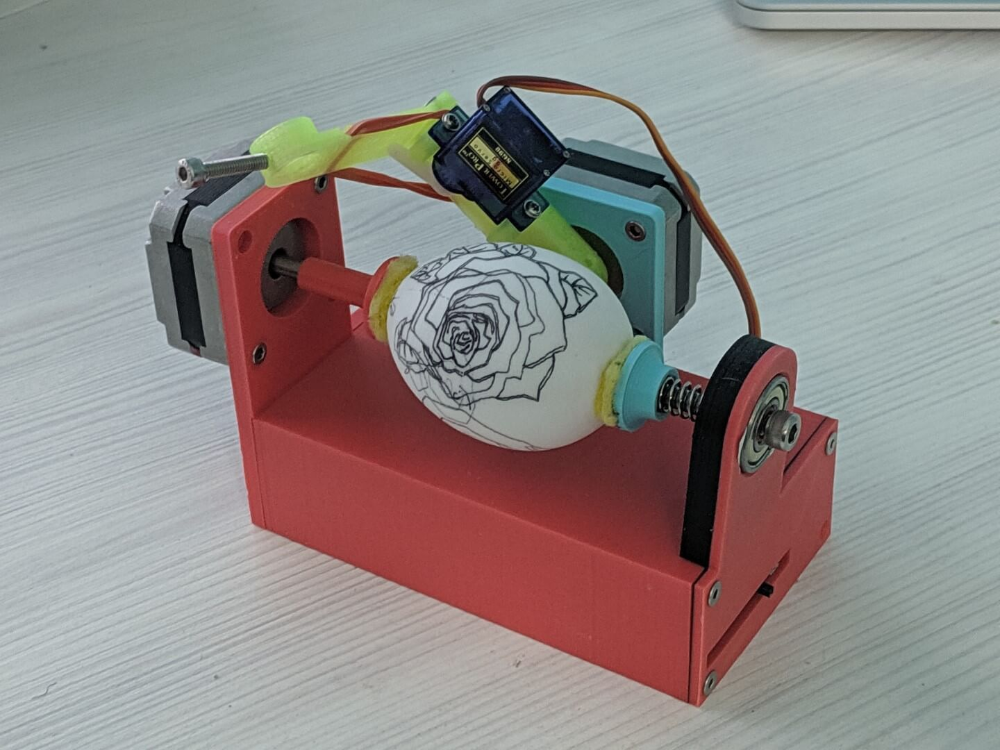
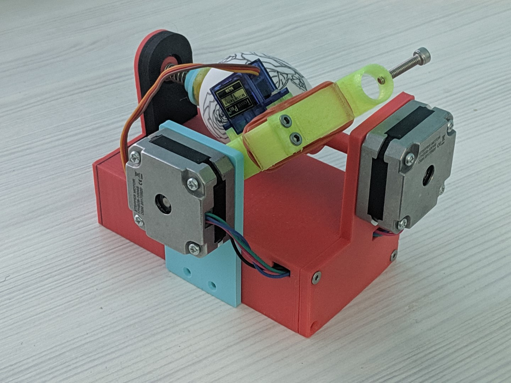

# (WIP) EggbotWireless
My attempt at making the ordinary egg-drawing robot a bit special, by adding a battery and a esp8266 to it.





## Known issues

It's not quite "wireless and portable" yet, for the reasons mentioned:

* The servo motor triggers overcurrent protection, so external USB power is needed (possible solutions are either using a low-power servo or fixing the li-ion to 5v booster circuit)

* The GCode is generated by inkscape, so needs a computer

## Getting started

### How to build the firmware

Should just work with platformio, but if you're on windows then you need to copy the repo with symlinks 

Also, when uploading the firmware to ESP8266 don't forget to upload the SPIFFS as well - it contains the simple web interface that allows you to run GCode on the device.

If you want it to connect to your WiFi, then you also should either change the defaults in the ConfigManager.cpp
Or you can set the configuration via serial:
```
lcp wifiMode client
lcp wifiSSID (your ssid)
lcp wifiPass (your password)
lcw
```
*(lcp stands for "local config put")*

*(lcw stands for "local config write") which saves it to EEPROM*

### How to create GCode

Now creating gcode for this thing is quite tricky - you can use the gcodetools Inkscape extension.

The process is supposed to be like this:

1. Open Utils/egg.svg with Inkscape
2. Insert something you want to draw as a child of Layer 1 (the rectangle is the egg boundary)
3. Make it a path
4. Use path to gcode (Also set minimal arc radius in the settings to something big as drawing arcs with g02 is not supported)

You can look at spiral.svg for an example